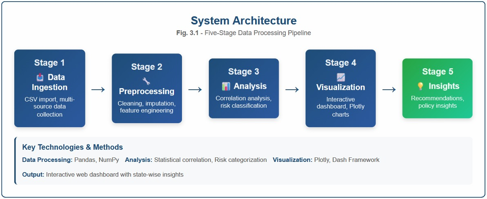
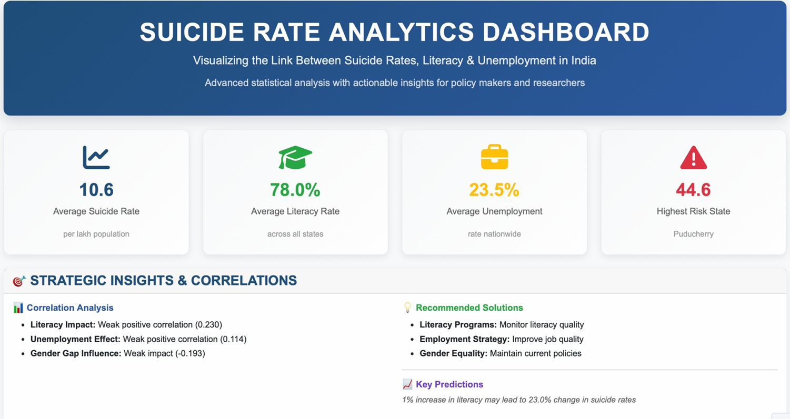
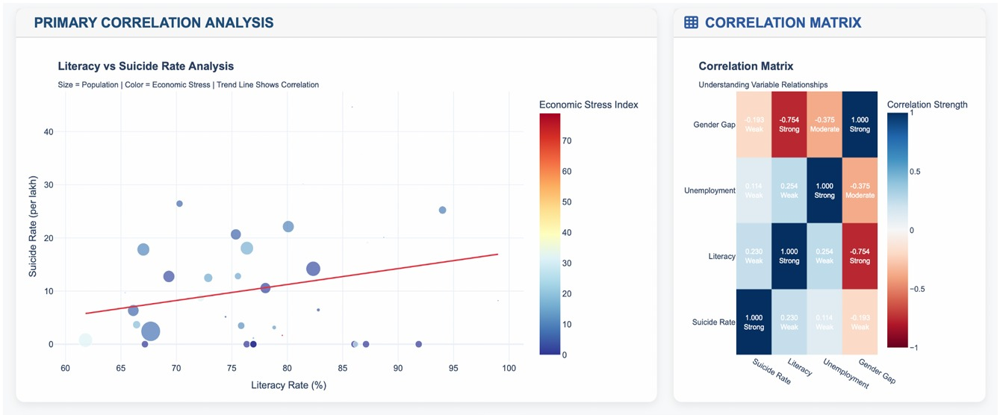
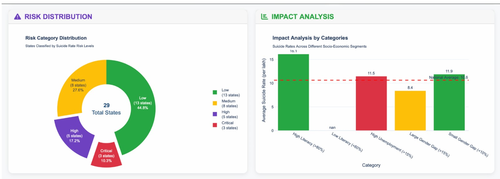
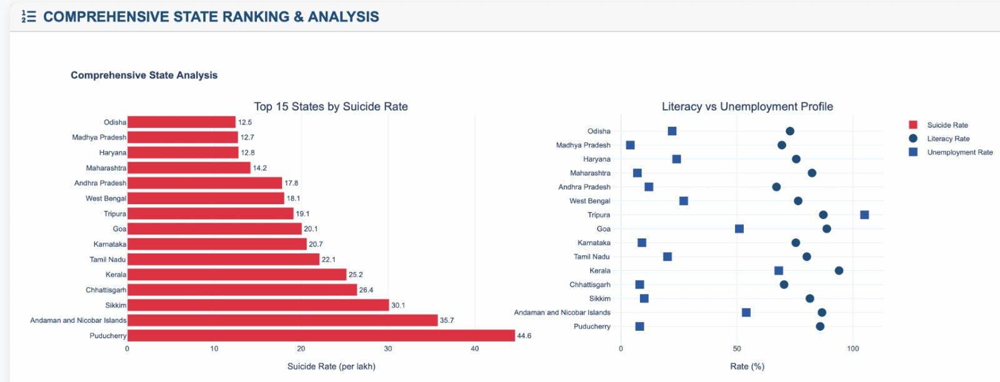
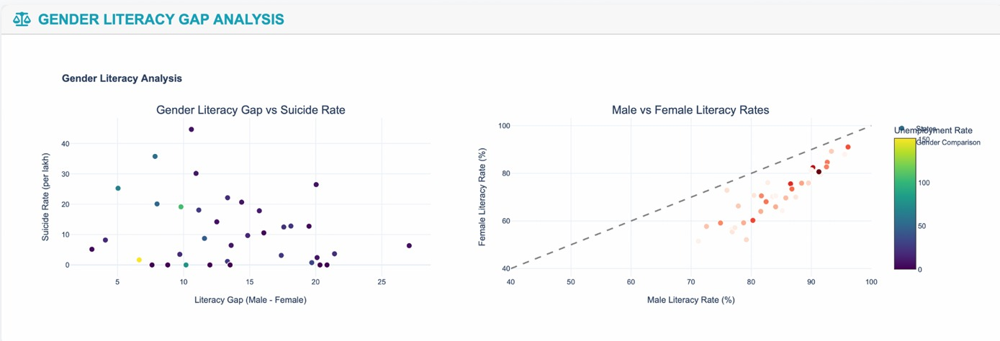
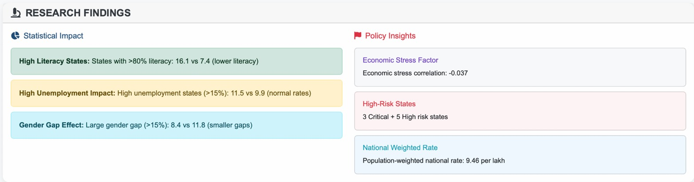
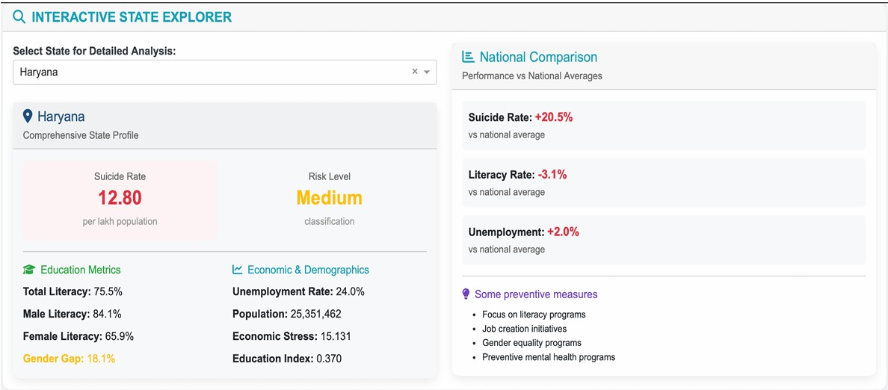

# Suicide Rate Analytics Dashboard

**Visualizing the Link Between Suicide Rates, Literacy & Unemployment in India**

Advanced statistical analysis with actionable insights for policy makers and researchers.


## About

This project analyzes state-wise suicide rates in India and their correlation with literacy rates, unemployment rates, and gender gaps. It features a five-stage data processing pipeline — from data ingestion through preprocessing, analysis, visualization, to actionable insights — built with Python, Pandas, Plotly, and Dash.

## System Architecture



The pipeline follows five stages:

| Stage | Description | Tools |
|-------|-------------|-------|
| **1. Data Ingestion** | CSV import, multi-source data collection | Pandas |
| **2. Preprocessing** | Cleaning, imputation, feature engineering | Pandas, NumPy |
| **3. Analysis** | Correlation analysis, risk classification | Statistical methods |
| **4. Visualization** | Interactive dashboard, Plotly charts | Plotly, Dash |
| **5. Insights** | Recommendations, policy insights | Data-driven |

## Features

- **Interactive Dashboard** — Built with Dash & Plotly for real-time exploration
- **Correlation Analysis** — Literacy vs Suicide Rate with bubble charts and heatmaps
- **Risk Classification** — States categorized into Low, Medium, High, and Critical risk levels
- **Gender Gap Analysis** — Male vs Female literacy comparison and its impact on suicide rates
- **State Explorer** — Select any state for a comprehensive profile with national comparison
- **Research Findings** — Statistical impact summaries and policy recommendations

## Dashboard Sections

1. **Overview** — Key metrics: Average Suicide Rate, Literacy Rate, Unemployment, Highest Risk State
2. **Correlation Analysis** — Scatter plots and correlation matrix
3. **Risk Distribution & Impact** — Donut chart and category-wise impact analysis
4. **State Ranking & Analysis** — Top 15 states by suicide rate with literacy/unemployment profiles
5. **Gender Gap Analysis** — Gender literacy gap vs suicide rate and male vs female literacy comparison
6. **Research Findings** — Statistical insights and policy recommendations
7. **Interactive State Explorer** — Detailed per-state analysis with preventive measures

## Project Structure

```
Suicide-Rate-Analytics-Dashboard/
├── data/
│   ├── raw/                          # Original source datasets
│   │   ├── suicides.csv              # State-wise suicide data (2001-2012)
│   │   ├── literacy.csv              # State-wise literacy rates (Census 2011)
│   │   ├── unemployment.csv          # State-wise unemployment rates
│   │   └── global_data_cleaned.csv   # Global suicide data (cleaned)
│   └── processed/                    # Cleaned and merged datasets
│       ├── final_corrected_dataset.csv
│       ├── final_corrected_dataset.xlsx
│       └── merged_final_data_cleaned(1).csv
├── notebooks/
│   ├── DVP_DASHBOARD.ipynb           # Main dashboard notebook
│   ├── miniproj_preprocess.ipynb     # Data preprocessing pipeline
│   ├── merged_data.ipynb             # Data merging notebook
│   └── Final_code.ipynb              # Suicide rate calculation
├── screenshots/                      # Dashboard screenshots
├── .gitignore
├── LICENSE
├── README.md
└── requirements.txt
```

## Tech Stack

- **Python** — Core programming language
- **Pandas & NumPy** — Data processing and analysis
- **Plotly & Dash** — Interactive visualizations and dashboard
- **Dash Bootstrap Components** — Responsive UI layout
- **Jupyter Notebook** — Development and exploration

## Getting Started

### Prerequisites

- Python 3.8 or higher
- pip (Python package manager)

### Installation

1. **Clone the repository**
   ```bash
   git clone https://github.com/jineshagandhi/Suicide-Rate-Analytics-Dashboard.git
   cd Suicide-Rate-Analytics-Dashboard
   ```

2. **Install dependencies**
   ```bash
   pip install -r requirements.txt
   ```

3. **Run the dashboard**
   ```bash
   cd notebooks
   jupyter notebook DVP_DASHBOARD.ipynb
   ```
   Run all cells to launch the interactive dashboard.

## Data Sources

- **Suicide Data** — National Crime Records Bureau (NCRB), India
- **Literacy Data** — Census of India, 2011
- **Unemployment Data** — Government of India employment surveys

## Key Findings

- **Average Suicide Rate**: 10.6 per lakh population
- **Highest Risk State**: Puducherry (44.6 per lakh)
- **Literacy Impact**: Weak positive correlation (0.230) with suicide rates
- **Unemployment Effect**: Weak positive correlation (0.114)
- **Gender Gap Influence**: Weak negative impact (-0.193)
- **3 Critical + 5 High** risk states identified nationwide

## Screenshots

<details>
<summary>Click to view dashboard screenshots</summary>

### Dashboard Overview


### Correlation Analysis


### Risk Distribution


### State Rankings


### Gender Gap Analysis


### Research Findings


### State Explorer


</details>

## Author

**Jinesha Gandhi**
MIT World Peace University (MITWPU)

## License

This project is licensed under the MIT License — see the [LICENSE](LICENSE) file for details.
